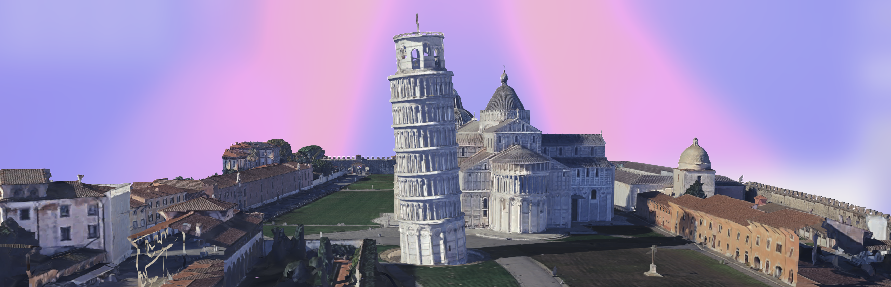

<p align="center">
  
</p>

<h1 align="center">🌍 Google Earth 3D Exporter CLI</h1>

<p align="center">
  A powerful command-line tool for exporting textured 3D data from <strong>Google Earth</strong> using octant-based tiles.  
  Works out of the box for macOS, Windows and Linux — either via local development or prebuilt binaries.
</p>

---

## ✨ Features

- Export high-quality textured 3D geometry from Google Earth
- Octant-based selection for accurate region export
- Built-in CLI for cross-platform use
- Written in TypeScript for better maintainability and type safety
- Based on the excellent work of [retroplasma/earth-reverse-engineering](https://github.com/retroplasma/earth-reverse-engineering)

---

## 📦 Requirements

Before you get started, make sure you have the following installed:

- [Node.js (>=18)](https://nodejs.org/)
- [npm](https://www.npmjs.com/)
- [git](https://git-scm.com/)

---

## 🚀 Getting Started

Clone the repository:

```bash
git clone https://github.com/your-username/node-earth-export.git
cd node-earth-export
```

Install dependencies:

```bash
npm install
```

---

## 🗺️ Exporting 3D Area

You can export a region using latitude and longitude bounds.

> 📌 **Note**: Google Earth uses _octants_ to load tiles. You can enable octant grid via:
> `View > Show Grid` or press `Cmd + G` / `Ctrl + G`. The area for export is formed by two diagonal corners of the bounding box as in the example in the photo below.

  

> To run export you have to paste coordinates as following: `--bbox=lat1:long1;lat2:long2` marking special characters with slashes `\`

> For example: First point coordinates - `43°43'26"N 10°23'49"E` Second point coordinates - `43°43'21"N 10°23'34"E` Shod create string: `--bbox=43\°43\'26\"N:10\°23\'49\"E\;43\°43\'21\"N:10\°23\'34\"E`

Run:

```bash
npx ts-node ./src/index.ts --bbox=43\°43\'26\"N:10\°23\'49\"E\;43\°43\'21\"N:10\°23\'34\"E
```

Use degrees-minutes-seconds format, separated by a semicolon (`;`) for two diagonal corners of the bounding box.

---

## 🛠 Build Standalone Binary

You can compile the entire project into a single executable file for your platform.

```bash
npm run pkg
```

This will produce binaries for macOS, Windows, and Linux in the `build/` directory:

```bash
./build/earth-exporter-macos
./build/earth-exporter-win.exe
./build/earth-exporter-linux
```

Now you can use it without installing Node.js:

```bash
./build/earth-exporter-macos --bbox="..."
```

---

## 📸 Screenshots

<p align="center">
  
  
  
  
  
</p>

## 🙏 Credits

- Based on [retroplasma/earth-reverse-engineering](https://github.com/retroplasma/earth-reverse-engineering)
- Thanks to contributors and the open-source GIS/3D tooling community!
